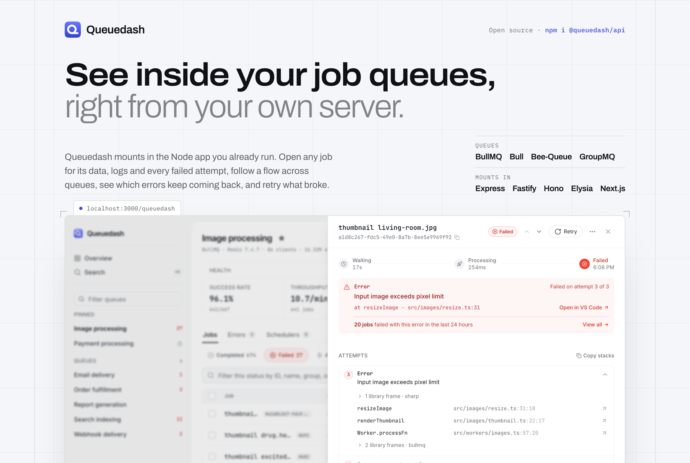
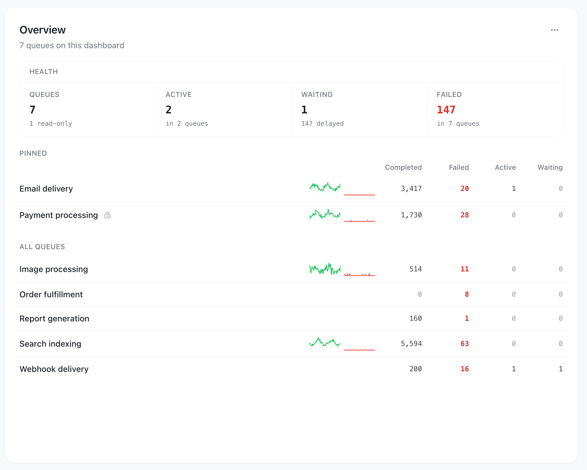
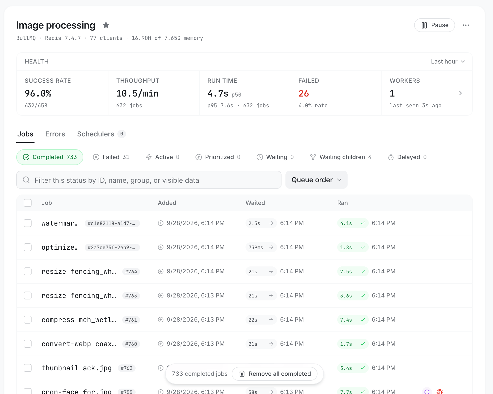
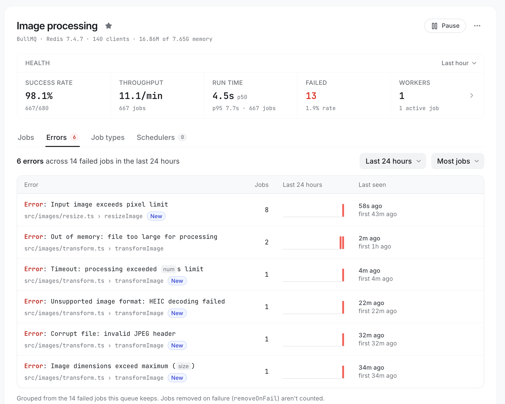
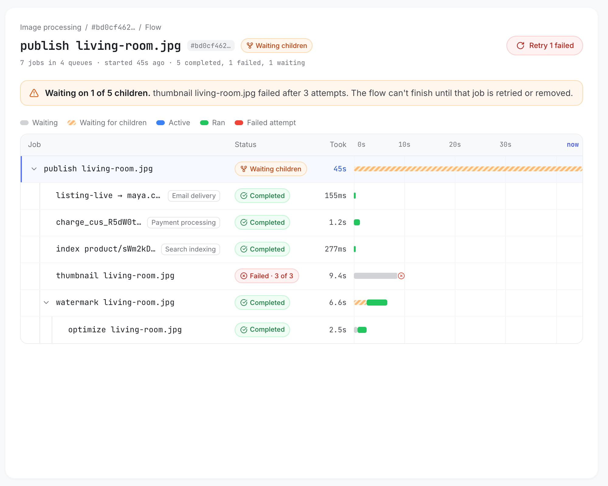
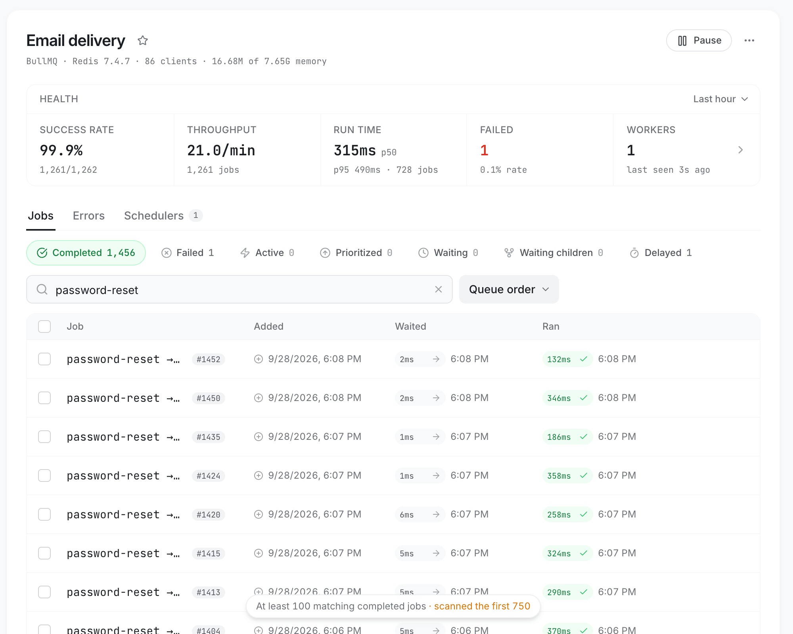
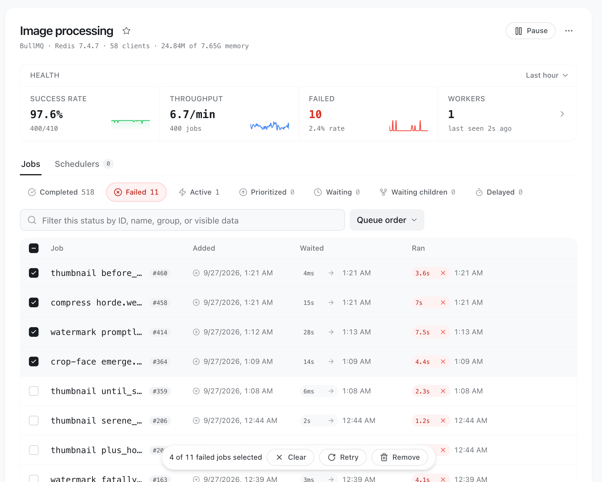
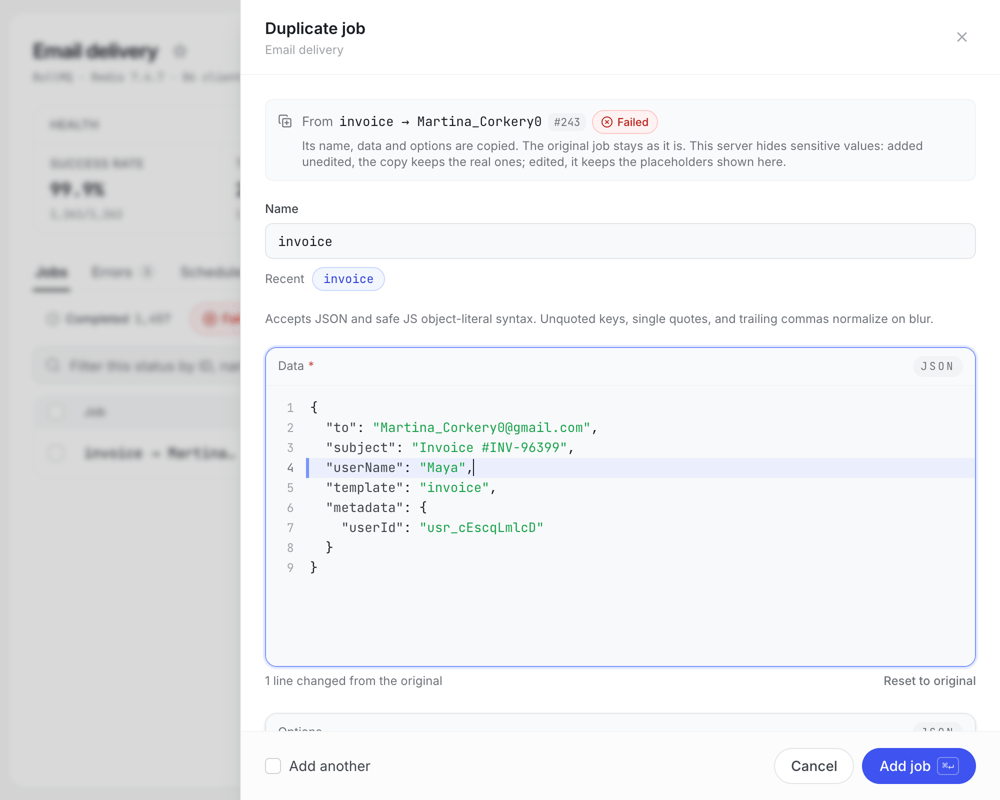
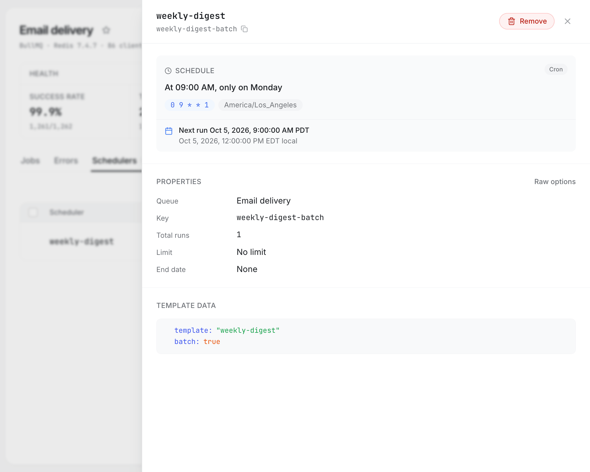

<p align="center">
  <a href="https://www.queuedash.com" target="_blank" rel="noopener">
    <picture>
      <source media="(prefers-color-scheme: dark)" srcset="assets/screenshots/hero-dark.png">
      
    </picture>
  </a>
</p>

<p align="center">
  <a aria-label="NPM version" href="https://www.npmjs.com/package/@queuedash/api">
    
  </a>
  <a aria-label="License" href="https://github.com/alexbudure/queuedash/blob/main/LICENSE">
    
  </a>
</p>

Queuedash is a dashboard for Bull, BullMQ, Bee-Queue, and GroupMQ that runs
inside the Node.js server you already have. See how every queue is doing, open
any job for its data, logs, and every failed attempt, and retry, remove, or
promote what you find. You decide who can sign in, which queues they can see or
change, and which job data reaches their browser.

## What you can do

<table>
  <tr>
    <td width="50%" valign="top">
      <picture>
        <source media="(prefers-color-scheme: dark)" srcset="assets/screenshots/overview-dark.png">
        
      </picture>
      <p><strong>See every queue at once</strong><br>
      What each queue finished and failed in the last hour, and what's still waiting.</p>
    </td>
    <td width="50%" valign="top">
      <picture>
        <source media="(prefers-color-scheme: dark)" srcset="assets/screenshots/queue-dark.png">
        
      </picture>
      <p><strong>Watch a queue's health</strong><br>
      Success rate, throughput, failures, run times at p50 and p95, and its workers, from the last minute to the last week. Job types break it down by job name, and the workers panel sets the queue's concurrency and rate limit.</p>
    </td>
  </tr>
  <tr>
    <td width="50%" valign="top">
      <picture>
        <source media="(prefers-color-scheme: dark)" srcset="assets/screenshots/errors-dark.png">
        
      </picture>
      <p><strong>See what keeps failing</strong><br>
      The Errors tab groups failed jobs by their error and the line of your code that threw it, so one bug shows up once, however many jobs it failed. Retry or remove a whole group.</p>
    </td>
    <td width="50%" valign="top">
      <picture>
        <source media="(prefers-color-scheme: dark)" srcset="assets/screenshots/flow-dark.png">
        
      </picture>
      <p><strong>Follow a flow across queues</strong><br>
      Lay out a flow's jobs on one timeline, whichever queues they ran in, and see what the parent is still waiting on.</p>
    </td>
  </tr>
  <tr>
    <td width="50%" valign="top">
      <picture>
        <source media="(prefers-color-scheme: dark)" srcset="assets/screenshots/search-dark.png">
        
      </picture>
      <p><strong>Find the job you need</strong><br>
      Press <kbd>/</kbd> to filter by text, pick a date range, or sort by date. The view lives in the URL, so you can share it. <kbd>⌘</kbd> <kbd>K</kbd> finds any job in any queue by its id or text, and jumps to any queue, status, or page.</p>
    </td>
    <td width="50%" valign="top">
      <picture>
        <source media="(prefers-color-scheme: dark)" srcset="assets/screenshots/bulk-dark.png">
        
      </picture>
      <p><strong>Handle jobs in bulk</strong><br>
      Select jobs, or everything a filter matches, and retry, remove, or promote them together.</p>
    </td>
  </tr>
  <tr>
    <td width="50%" valign="top">
      <picture>
        <source media="(prefers-color-scheme: dark)" srcset="assets/screenshots/duplicate-dark.png">
        
      </picture>
      <p><strong>Fix, add and duplicate jobs</strong><br>
      Edit a failed job's data and retry that same job, move a delayed one, add a job, or duplicate one to run it again with a change. Queuedash marks what you changed.</p>
    </td>
    <td width="50%" valign="top">
      <picture>
        <source media="(prefers-color-scheme: dark)" srcset="assets/screenshots/schedulers-dark.png">
        
      </picture>
      <p><strong>Manage schedulers</strong><br>
      See what each BullMQ scheduler runs and when it runs next. Add, edit, or remove them.</p>
    </td>
  </tr>
</table>

## Quick start

Install Queuedash next to the queue library and web framework you already use.
It needs Node 22 or newer.

```bash
npm install @queuedash/api
```

Mount it in your server. Here it is in Express with a BullMQ queue:

```typescript
import { createQueuedashExpressMiddleware } from "@queuedash/api";
import { Queue } from "bullmq";
import express from "express";

const app = express();
const emails = new Queue("emails", {
  connection: { host: "localhost", port: 6379 },
});

app.use(
  "/queuedash",
  createQueuedashExpressMiddleware({
    ctx: {
      queues: [{ queue: emails, displayName: "Emails", type: "bullmq" }],
    },
  }),
);

app.listen(3000);
```

Then open [http://localhost:3000/queuedash](http://localhost:3000/queuedash).

## Integrations

| Framework    | Use                                               | Example                                    |
| ------------ | ------------------------------------------------- | ------------------------------------------ |
| Express      | `createQueuedashExpressMiddleware`                | [Express](./examples/with-express)         |
| Fastify      | `fastifyQueuedashPlugin`                          | [Fastify](./examples/with-fastify)         |
| Hono         | `createHonoAdapter`                               | [Hono](./examples/with-hono)               |
| Elysia / Bun | `queuedash`                                       | [Elysia](./examples/with-elysia-and-bun)   |
| Next.js      | `appRouter` + `<QueuedashApp />`                  | [Next.js App Router](./examples/with-next) |
| Docker       | `QUEUES_CONFIG_JSON` or `QUEUES_CONFIG_FILE_PATH` | [Docker](#docker)                          |

To put the dashboard inside your own React or Next.js app, see
[`@queuedash/ui`](./packages/ui/README.md).

## Queue libraries

| Library   | Versions         | Discovery | Workers | Schedulers | Docker |
| --------- | ---------------- | --------- | ------- | ---------- | ------ |
| Bull      | 3, 4             | Yes       | Yes     | No         | Yes    |
| BullMQ    | 5.60 or newer, 6 | Yes       | Yes     | Yes        | Yes    |
| Bee-Queue | 1, 2             | No        | No      | No         | Yes    |
| GroupMQ   | 1                | No        | No      | No         | No     |

Queuedash hides what a library can't do instead of faking it. BullMQ gets the
most: health metrics, logs, flows, priorities, and schedulers. GroupMQ shows its
groups. Bee-Queue sticks to what its API can do safely.

Queuedash uses whichever version your app installs. If you pause queues from the
dashboard, keep its BullMQ at or ahead of the one your producers run
([here's why](./packages/api/README.md#install)).

## Configuration

Everything is set on the server, in the `ctx` object you pass to the adapter,
and nothing in the browser can loosen it. Create `ctx` once and reuse it:
Queuedash caches its queue list and Redis connections per context.

These are the settings most people reach for. The
[`@queuedash/api` README](./packages/api/README.md) has all of them.

### Sign-in

```typescript
createQueuedashExpressMiddleware({
  auth: {
    username: process.env.QUEUEDASH_AUTH_USERNAME!,
    password: process.env.QUEUEDASH_AUTH_PASSWORD!,
    session: {
      secret: process.env.QUEUEDASH_AUTH_SESSION_SECRET,
    },
  },
  ctx,
});
```

Give the Express, Fastify, Hono, or Elysia adapter an `auth` option and
Queuedash shows its own login page, then keeps you signed in with a signed,
`HttpOnly` cookie. Passwords never go into browser storage, and the server
checks every API request.

Sessions last 12 hours unless you set `session.ttlSeconds`. Without
`session.secret`, a restart signs everyone out; set the same secret on every
instance to keep sessions across restarts and replicas. If TLS ends at a proxy in
front of your app, add `session.secure: true`. Set `mode: "basic"` if you'd
rather have the browser's own password prompt.

It's one shared login, not user accounts, roles, or SSO.

### Branding and defaults

```typescript
const ctx = {
  queues,
  ui: {
    branding: {
      name: "Acme Queues",
      logoUrl: "/assets/acme-logo.svg",
      faviconUrl: "/assets/acme-favicon.svg",
    },
    defaults: {
      theme: "system",
      refreshIntervalMs: 2_000,
      timestamps: "relative",
    },
  },
};
```

Your name and logo show in the sidebar and on the login page. `defaults` sets
where everyone starts. People can change the theme, refresh rate, density,
timestamps, and more for themselves in Settings, and those choices stay in their
browser. If several dashboards share a domain, give each one an `instanceId` so
their settings don't mix.

### Access rules

```typescript
const ctx = {
  queues,
  access: {
    default: "full",
    rules: [
      { queues: ["payments-*"], mode: "read-only" },
      { queues: ["internal-*"], mode: "hidden" },
      { queues: ["email"], deny: ["queue.empty", "job.remove"] },
    ],
  },
};
```

Each queue is `full`, `read-only`, or `hidden`, and you can switch off single
actions, like removing jobs, for any queue. Patterns can use `*`. Rules apply in
order: a later match can change the mode, and denied actions add up.

The server enforces all of it, not just the buttons. A hidden queue never shows
up, and asking for it by name gets you "not found". The API README lists
[every action you can deny](./packages/api/README.md#queue-access).

### Privacy

```typescript
const ctx = {
  queues,
  privacy: {
    redact: {
      keys: ["customerSecret"],
      paths: ["data.customer.ssn", "opts.headers.authorization"],
    },
    expose: {
      stacktraces: false,
      logs: false,
      returnValues: false,
    },
  },
};
```

Redaction happens on the server, before a job is sent to the browser.
`redact: true` covers common secret names like `password`, `token`, and
`authorization`. Pass an object instead to add your own keys and paths on top.
Anything set to `false` under `expose` is never sent at all, so it can't be
searched either. While `redact` is set, or scheduler data is hidden, schedulers
can't be edited from the dashboard, because saving would write the redacted
values back.

### Queue discovery

```typescript
const ctx = {
  discovery: {
    type: "bullmq",
    connectionUrl: "redis://localhost:6379",
    prefix: "bull",
  },
};
```

Rather than listing your queues, let Queuedash find the Bull or BullMQ queues in
a Redis instance. It rescans in the background and keeps the last good list if
Redis has a hiccup. Discovery doesn't cover Bee-Queue, GroupMQ, or Redis
Cluster, so list those in `queues`, which works alongside it.

Discovery opens its own Redis connections. Fastify closes them for you on
shutdown; with the other adapters, `await closeQueuedashContext(ctx)` when your
server stops.

### Search

Filtering looks through one status of one queue and matches job ids, names,
groups, errors, and any data you can see. It stops after 5,000 jobs, or sooner if
you set `search.maxScanned` (anywhere from 25 to 5,000). Bulk actions on a filter
use the same limit and tell you when they stopped short.

## Docker

Don't want to touch your app? Run the image and point it at Redis:

```bash
docker run -p 3000:3000 \
  -e QUEUEDASH_AUTH_USERNAME='admin' \
  -e QUEUEDASH_AUTH_PASSWORD='change-me' \
  -e QUEUES_CONFIG_JSON='{"queues":[{"name":"reports","displayName":"Reports","type":"bullmq","connectionUrl":"redis://host.docker.internal:6379"}]}' \
  ghcr.io/alexbudure/queuedash:latest
```

Then open [http://localhost:3000](http://localhost:3000).

To keep the config in a file, mount it and set `QUEUES_CONFIG_FILE_PATH` instead
of `QUEUES_CONFIG_JSON`. The config takes the same `ui`, `privacy`, `access`,
`search`, and `discovery` settings as above, minus anything that needs a
function. The image works with Bull, BullMQ, and Bee-Queue queues. A BullMQ queue
can use `connectionUrl` or `clusterNodes`, and discovery works for Bull and
BullMQ.

The image ships BullMQ 6, which handles queues written by BullMQ 5 and 6, so it's
safe in front of either.

Sign-in is set with environment variables:

- `QUEUEDASH_AUTH_USERNAME` and `QUEUEDASH_AUTH_PASSWORD` turn on the login.
- `QUEUEDASH_AUTH_MODE` is `session` (the default) or `basic`.
- `QUEUEDASH_AUTH_SESSION_SECRET` keeps sessions valid across restarts and replicas.
- `QUEUEDASH_AUTH_SESSION_TTL_SECONDS` sets how long a session lasts, from 60 seconds to 30 days.
- `QUEUEDASH_AUTH_COOKIE_SECURE` turns the cookie's `Secure` flag on (`true`) or off (`false`).
- `QUEUEDASH_TRUST_PROXY` is `true`, `false`, or the number of proxy hops, from 1 to 10.

Behind a reverse proxy that handles HTTPS, set `QUEUEDASH_TRUST_PROXY=true` or
`QUEUEDASH_AUTH_COOKIE_SECURE=true`. Otherwise the container only sees plain
HTTP and can't mark the session cookie `Secure`.

## Security

Queuedash can change production data. Depending on your access rules, it can
add, retry, promote, and remove jobs, clean and empty queues, and pause them.
Treat it like any other admin tool:

- Turn on the built-in login, or put the dashboard and its API behind an authenticated reverse proxy.
- Keep it on a private network if you can.
- Use access rules to take away actions people don't need.
- Use privacy settings to keep sensitive job data out of the browser.

Access rules apply to everyone who can open the dashboard, and the built-in
login is one shared account. For separate accounts or SSO, put an authenticated
reverse proxy in front.

## Packages

| Package                                            | What it is                                                                    |
| -------------------------------------------------- | ----------------------------------------------------------------------------- |
| [`@queuedash/api`](./packages/api/README.md)       | The server side: queue adapters, the API, discovery, access rules, privacy    |
| [`@queuedash/ui`](./packages/ui/README.md)         | The React dashboard, for Next.js or your own React app                        |
| [`@queuedash/client`](./packages/client/README.md) | A prebuilt copy of the dashboard that the server adapters load in the browser |

Coming from Queuedash 3? The old `QueueDash*` names, like
`createQueueDashExpressMiddleware`, still work but are deprecated. The
[changelog](./packages/api/CHANGELOG.md) covers everything else that changed.

## Queuedash Pro

Queuedash Pro adds alerts, longer history, and team access. See
[queuedash.com](https://www.queuedash.com).

## Acknowledgements

Queuedash was inspired by these open-source projects:

- [bull-board](https://github.com/vcapretz/bull-board)
- [bull-monitor](https://github.com/s-r-x/bull-monitor)
- [bull-arena](https://github.com/bee-queue/arena)
